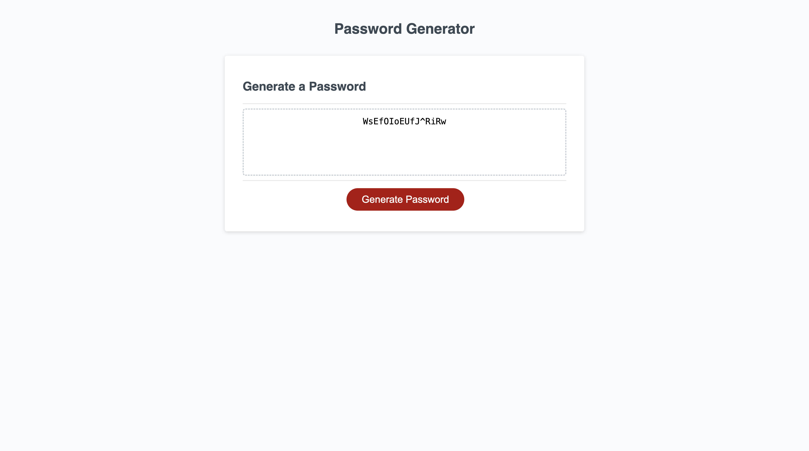

# AJ's Password Generator

## Description

For someone that is not well with creating strong passwords. Being able to create a password generator that creates a strong secured password will not only help myself but others that struggle with creating a strong password as well! Which provides better security for myself and others.

## Image(s)

## Link(s)

Deployed Application: https://awjcodes.github.io/password-generator/

## Usage

Go create yourself your own password into your own liking! By choosing your own password length and adding specific characters such as numbers (1,2,3, etc.), lower case (a,b,c, etc.) and upper case letters (A,B,C, etc.), along with special characters (!, @, #, etc.)!

Once you load onto the page you are presented with the Password Generator with a Generate Button.
You click on the Generate button to begin creating your own password.
You are than asked certain questions that will help in creating your password.
Once you've gone through all the prompts,
Your new password has been generated!
